# Instructions to set up an SSH server and client with OpenSSH

Info on OpenSSH. Includes how to set up an ssh server, ssh key-based authentication and more.

## On the Client side

### Install the required packages

Look for SSH binaries
~~~
which ssh
~~~
Check if the OpenSSH client is installed 
~~~
apt search openssh-client
~~~
If it's installed you will see something like this:

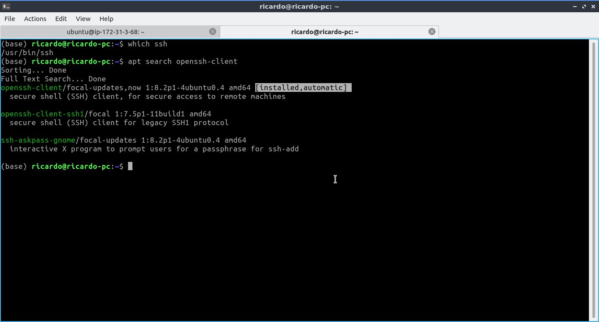

If not, install some updates first
~~~
 sudo apt update && sudo apt upgrade 
~~~
And then install the OpenSSH client
~~~
sudo apt install openssh-client
~~~
### Connect to an SSH server
Since we have the client already installed, run:
~~~
ssh username@ipadress 
~~~
In my case I will long in to an AWS EC2 instance using ssh key authentication (more on this later) so it looks like this:

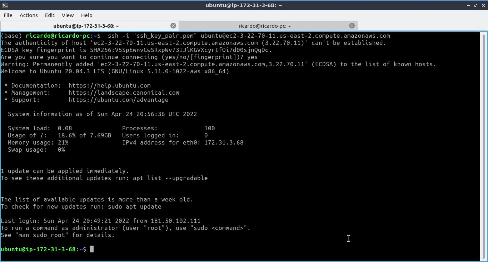

As long as the server is running and accepting incoming traffic on the port **22** you should at least get a password prompt. Whenever we connect for the first time it will ask us if we are sure we want to connect.

If this is the first time we connect to an ssh server, in the client, we will now have a .ssh folder that includes a **known_hosts** file. 

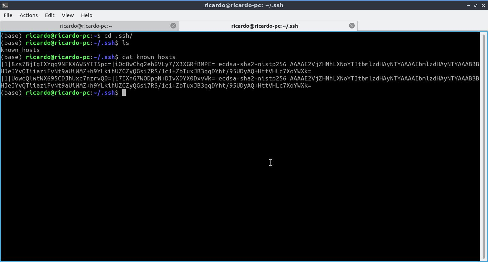

This file contains the fingerprint of all the SSH servers we have connected to. If we connect again to the same server, 
this time it won't ask if we are sure if we want to connect since the info is already in the **known_hosts** file. 

This is important because it prevents a man-in-the-middle attack. Let's say someone creates a malicious server and they were able to set our same ip address, if that's the case, when we try to connect, Ubuntu will see that out fingerprint has changed and when that happens it will raise a warning.

### Locating the auth.log file

In the client, when log into the server

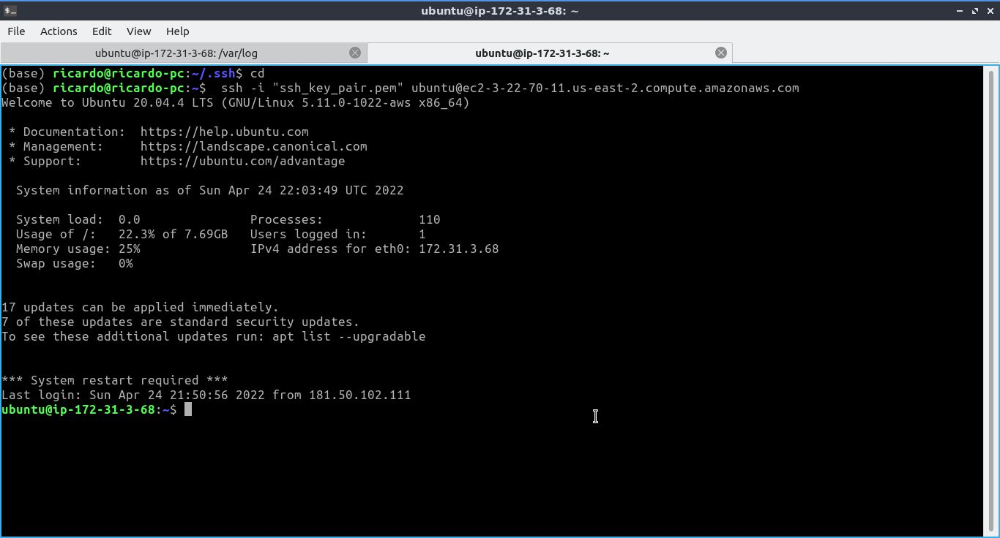

Locate the log directory
~~~
cd /var/log/
~~~

When we run
~~~
tail -f auth.log
~~~
we can track the changes for the auth.log for every login attempt

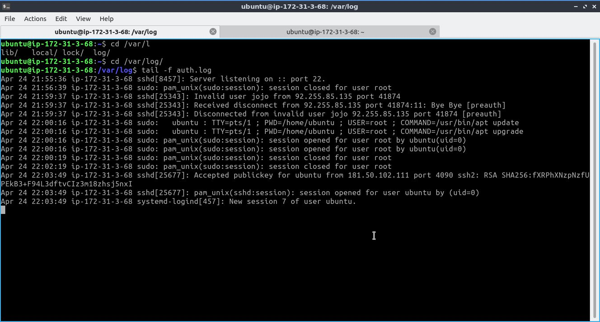

This file is very important since it allows to see what is going on whenever we attempt to connect to the server.

### Configuring the OpenSSH Client

Let's create a config file for the SSH client. Move into the .ssh folder
~~~
cd .ssh
~~~
Create the config file
~~~
touch config
~~~
And change the file this way

Now instead of doing
~~~
ssh username@ipadress
~~~
or 
~~~
ssh -i "public_key" username@ipaddress
~~~
We can just say 
~~~
ssh sshserver
~~~
Since I'm using a Public Key on my side it looks like this:
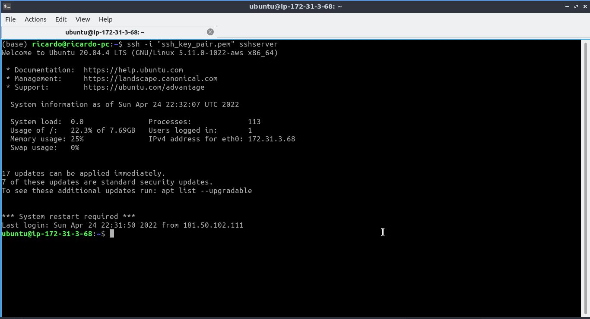

**Note** that the Host variable at the end can have whatever name you want.
Let's change the said variable this way:
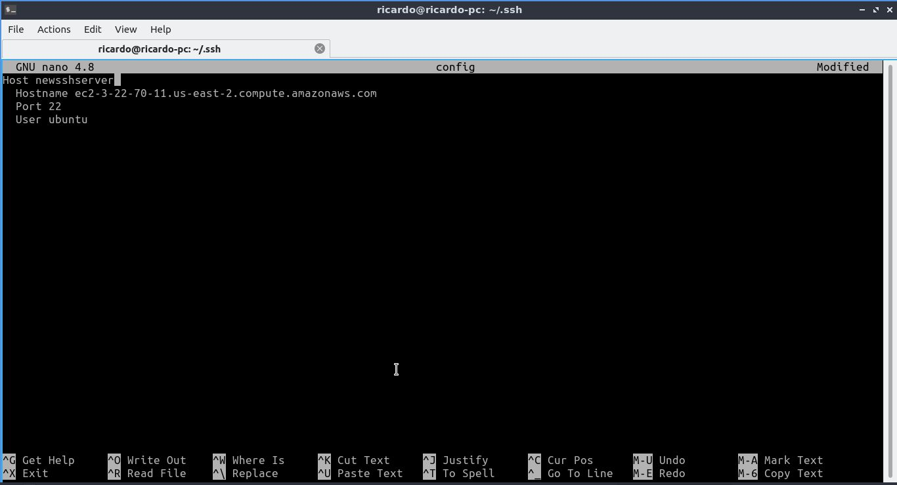

Now when I run:
~~~
ssh -i "public_key" newsshserver
~~~
We can see we are able to log in
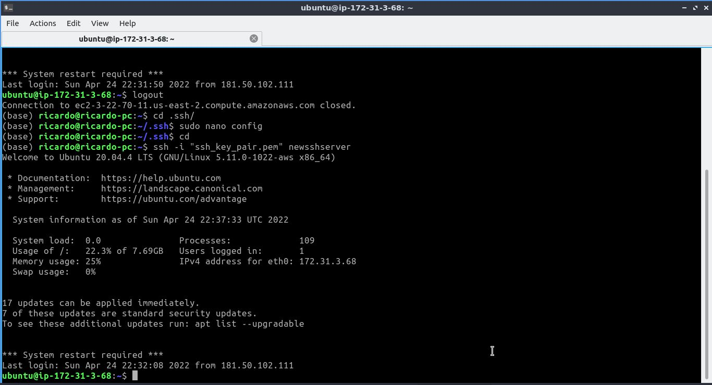

We can also include multiple servers in the file. It would look something like this:
~~~
Host newsshserver
  Hostname ec2-3-22-70-11.us-east-2.compute.amazonaws.com
  Port 22
  User ubuntu

Host otherserver
  Hostname 172.21.284.1
  Port 22
  User ricardo 
~~~

### Creating an SSH key
An SSH key is a more secure way to login into a server. It adds another layer of security in your server since most passwords tend to be predictable.

Inside .ssh run the following command to generate an ssh key:
~~~
ssh-keygen
~~~
It will create a new ssh key at /home/user/.ssh/id_rsa by default
**Important:** You want to make sure you don't already have a key in that directory. If you do, it will be overwritten and can be bad if the key is the only way in to the server.

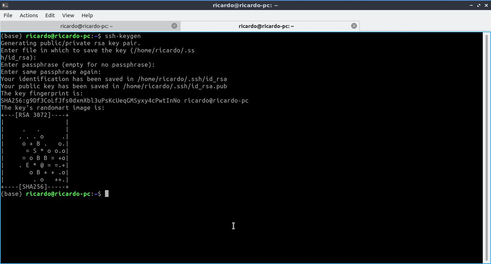

Now, in the .ssh directory we will two new files: id_rsa and id_rsa.pub. The last one is the public key and, since it is public, it could be shown to everybody. The private key on the other hand (The one without the .pub extension) should not, under any circumstance, be shared or published.

### Setting up the server to autenthicate via SSH key

In .ssh cat-out the public key:
~~~
cat id_rsa
~~~
Login into the remote server
~~~
ssh username@ipadresss
~~~
Setup the server to accept connections via that key.
Go to .ssh in the server. If the directory doesn't exists create it with mkdir .ssh. Then create a file called authorized_keys

Edit the file authorized_keys and paste the key. You can have multiple keys, each one on it's own line
~~~
sudo nano authorized_keys
~~~
Save the file and then login into the server.

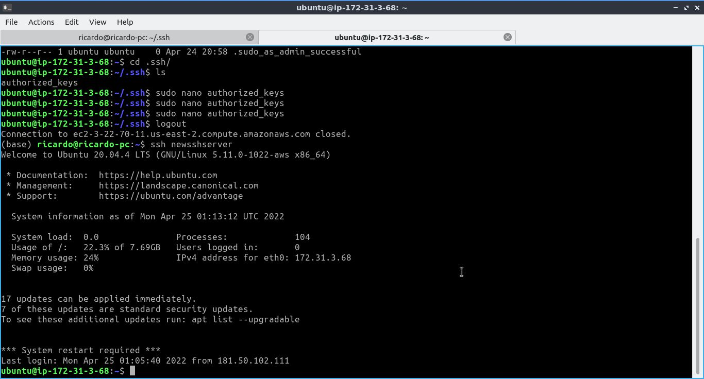

Note that, in my case, since I have an Amazon EC2 instance, to go into the remote server I had to specify the key (.rem file) to login. Now I can just run
~~~
ssh newsshserver
~~~
Again, what we just did was adding the public key on it's own line into the authorized_keys file of the .ssh folder of the server. 

When we used the ssh command to connect to the server, it checked the private key against the public key on the remote end, since they are a match, we have a connection.

If you want more information about what Ubuntu does when trying to connect to the remote server you can run:
~~~
ssh -v username@ipadress
~~~
### Easy way to set up SSH authentication
Another way is to create a new ssh key with ssh-keygen and then run:
~~~
ssh-copy-id -i ~/.ssh/id_rsa.pub username@ipaddress
~~~
The argument after -i is the location of the public key

### Managing SSH keys

You can have different ssh keys that are specific for each remote server.

Generating a key with a different type. This one is more secure and shorter than the default type. What goes after C is a commentary and is located at the end of the key. If we don't include it, it will default to our username@nameofcomputer.

Adding a comment allows us to add extra information that can include the purpose of that key.
~~~
ssh-keygen -t ed25519 -C "godzilla"
~~~
You can choose to save it under a different name. Entering a passphrase is option but it add another security layer.

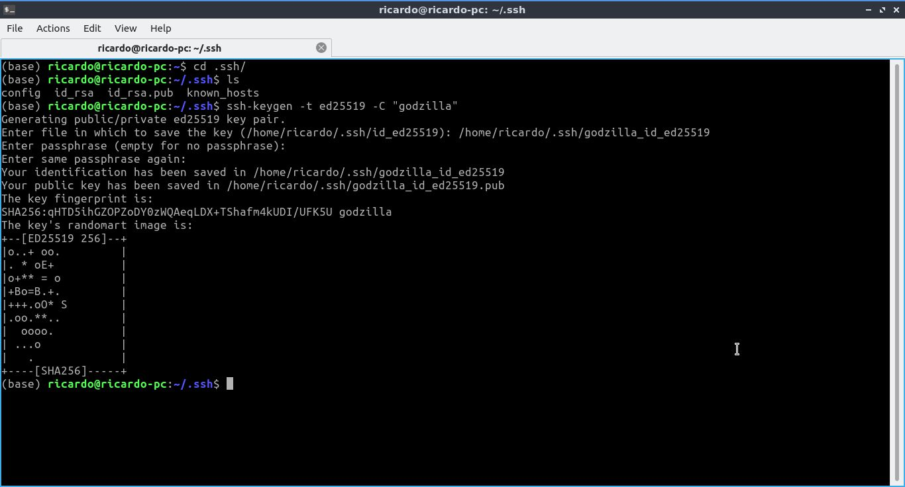

Let's compare the two types of keys.

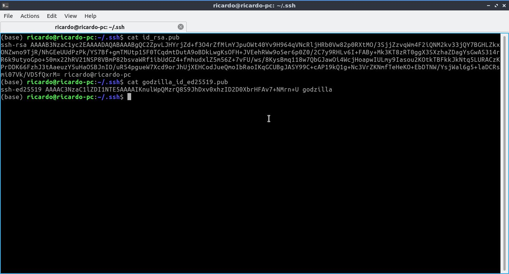

The second key is shorter and more secure because it uses a stronger type of cryptography. The comment is also added at the end.

Let's copy the new key to the server. Replace ubuntu@ec2-3-22-70-11.us-east-2.compute.amazonaws.com for username@ipaddress
~~~
ssh-copy-id -i ~/.ssh/godzilla_id_ed25519.pub ubuntu@ec2-3-22-70-11.us-east-2.compute.amazonaws.com
~~~
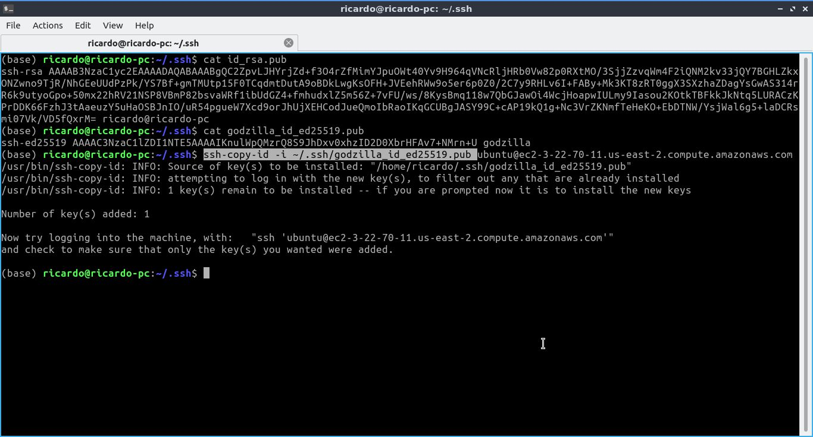

Now, when we log into the server and cat the authorized_keys file, we will see the new key added at the end. In my case, I already had to keys but the new one is highlighted. That's why it is very important to add comments to the keys.

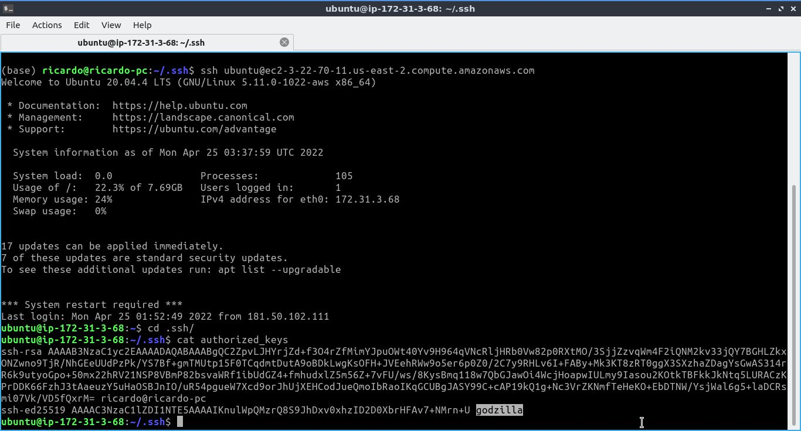

### Using the ssh agent to catch the key in memory to only enter the passphrase once
If you set up a passphrase you will notice that we are going to be asked to provide it everytime. To avoid this (type it only one time) we can use the ssh agent.

The ssh agent will retain the key in memory and allow you to use it to connect to the server. 

Checking if the ssh agent is runing
~~~
ps aux |grep ssh-agent
~~~

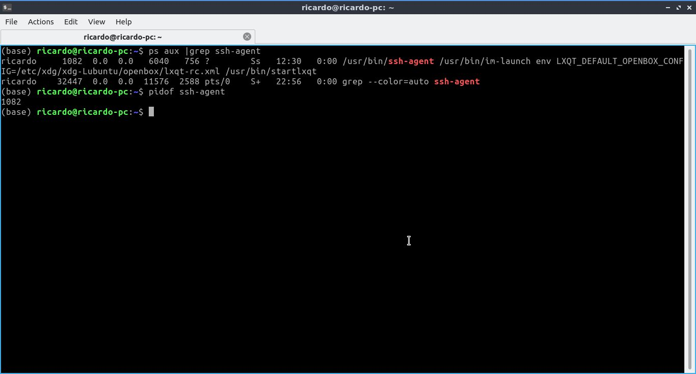

In my case it was already running and it had a specific pid (process).

In case it isn't running in your machine, you can start the ssh agent by runing:
~~~
eval "$(ssh-agent)"
~~~
Keep in mind that once we are disconected from the terminal, the ssh agent is gone. While it's still in memory and with the terminal open we can add the passphrase to the agent. This time we need to pass the private key.
~~~
ssh-add ~/.ssh/godzilla_id_ed25519.pub
~~~
Once we type the passphrase, when we login into the server again, it won't ask for it unless the terminal window is closed.

## On the server side

### SSH server configuration
